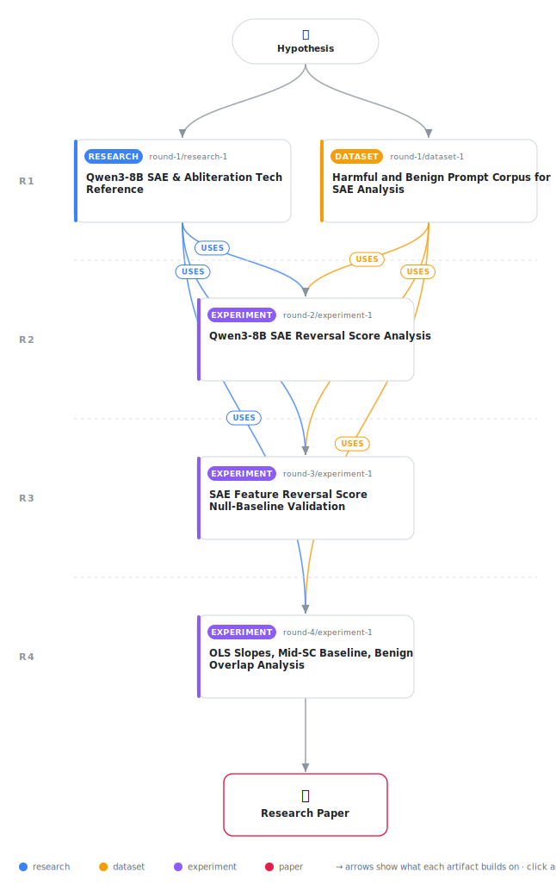

# Abliteration Cannot Erase RLHF: Geometric Evidence from SAE Encoder Directions in Qwen3-8B

<div align="center">

<a href="https://cdn.jsdelivr.net/gh/AMGrobelnik/ai-invention-4ac301-abliteration-cannot-erase-rlhf-geometric@main/workflow.svg">
<picture>
  <source media="(prefers-color-scheme: dark)" srcset="workflow-dark.svg">
  
</picture>
</a>

<sub>🖱️ <b><a href="https://cdn.jsdelivr.net/gh/AMGrobelnik/ai-invention-4ac301-abliteration-cannot-erase-rlhf-geometric@main/workflow.svg">Open the interactive diagram</a></b> — every card links to its artifact folder.</sub>

</div>

> **TL;DR** — We present the first encoder-direction-level mechanistic analysis of refusal abliteration in Qwen3-8B using the frozen Qwen-Scope base SAE. Two new per-direction metrics—the Reversal Score (directional preservation) and the OLS Slope (magnitude preservation)—demonstrate that every RLHF-sensitive SAE encoder direction has a positive Reversal Score (mean 0.921) and an OLS slope near unity (mean 0.986), meaning abliteration preserves the RLHF imprint in both direction and magnitude. Direct measurement of refusal-direction geometry (mean |cosθ| = 0.019) provides the mechanistic explanation: abliteration's orthogonalization geometrically cannot touch the RLHF-modified encoder directions. A 64.6% benign-SC overlap reveals the preserved imprint spans both harm-specific and general RLHF stylistic modifications. Three critical open gaps are identified: z_pre/z_post proxy validation, independent abliteration depth verification, and extension of the orthogonality measurement to the multi-dimensional refusal subspace identified by Joad et al. (2026).

<details>
<summary>Full hypothesis</summary>

RLHF safety fine-tuning and refusal abliteration operate on geometrically near-orthogonal subspaces in Qwen3-8B's residual stream. Five experimentally confirmed findings establish this, subject to one unverified assumption and two open mechanistic questions that define the next iteration's required experiments.

**Confirmed findings (all conditioned on abliteration completeness — see Critical Gap 1):**

(1) Directional preservation — the Reversal Score (PearsonR of RLHF-induced vs. abliteration-induced change vectors per encoder direction) for top-500 RLHF-sensitive SAE encoder directions at layer 22 is unimodal (Hartigan dip p=0.930) with mean=0.921, std=0.040, min=0.684, and zero directions with negative scores. A noise-free mid-SC baseline (features at 40th–60th SC percentile, SC_median≈1.12 ≫ 0.01) yields R̄=0.871, Cohen's d=1.087, p≈0, confirming selective preservation above any noise floor.

(2) Magnitude preservation — mean OLS no-intercept slope β̄=0.986±0.176 for the top-500 directions at layer 22 (β̄=0.954±0.191 at layer 20), with 86.4% of directions having β_f>0.8. However, 45.4% of directions have β_f>1.0 (amplification up to 1.725), which is mechanistically inconsistent with the simple geometric account: orthogonalizing weight matrices against a near-orthogonal direction should produce β_f slightly below 1.0, not systematically above it in a substantial minority. This amplification is an open mechanistic question. Candidate explanations include (a) upward bias from no-intercept OLS regression on vectors with non-zero means, (b) secondary indirect effects of weight-matrix orthogonalization through residual stream accumulation, or (c) non-linear amplification in the pre-topk projection regime. The amplification must be investigated in the next iteration: compare β_f with and without the no-intercept constraint (with-intercept OLS removes the mean-centering bias), characterize whether amplified directions cluster by Safety Change magnitude or semantic label, and report both β̄ estimates in the paper.

(3) Geometric orthogonality — mean |cos(r, w_enc(f))|=0.01854 at layer 22 and 0.02086 at layer 20 (confirmed across iter3 and iter4 to 5 decimal places). A cosine of 0.019 means the refusal direction projects onto <2% of each RLHF-modified encoder direction's magnitude. This is the most secure finding in this research: it is a direct measurement of the angle between weight vectors, independent of activation distributions, the pre-topk/post-topk distinction, and abliteration completeness. This geometric fact explains why β̄ ≈ 1 is the expected outcome *if* abliteration is complete and the refusal direction is one-dimensional.

(4) Centroid selectivity — the abliterated model's centroid in the RLHF-sensitive subspace is 4.35× closer to instruct than to base on harmful prompts at layer 22 (7.31× at layer 20), versus 1.16× in the RLHF-insensitive control (1.01× at layer 20) and 2.37× in the random control (1.63× at layer 20). These ratios currently lack bootstrap confidence intervals; adding 1000-resample bootstrap CIs for ratio_A/ratio_B and ratio_A/ratio_C is required before these numbers carry inferential weight.

(5) Benign-SC overlap — 323/500 (64.6%) of the top-500 RLHF-sensitive encoder directions also appear in the top-500 by benign-prompt Safety Change, establishing a STYLE_DOMINANT verdict: the majority of the preserved imprint captures general RLHF behavioral modifications (response formality, instruction-following structure, output style) rather than harm-specific semantic content. The remaining 35.4% (176 directions) are uniquely sensitive to harmful prompts. These 176 directions are candidate carriers of harm-concept representations, but this claim must be softened: they are defined purely by absence from the benign-SC top-500 rather than by validated semantic content, and z_pre/z_post validation is required before they can be asserted as harm-specific semantic representations rather than prompt-format artifacts.

**Critical Gap 1 (BLOCKING): Abliteration depth verification.** This is the single highest-priority unresolved issue, elevated to blocking by reviewer feedback. All main findings (R̄=0.921, β̄=0.986, centroid ratios) are explicitly conditioned on the huihui-ai/Huihui-Qwen3-8B-abliterated-v2 checkpoint implementing genuine refusal-direction removal. If abliteration is incomplete, the high R̄ and β̄ trivially reflect model proximity rather than preservation under genuine erasure. Two measurements from cached activations are required before the paper can be accepted: (a) fraction of AdvBench or HarmBench prompts producing a non-refusal response (expected >95%; below 80% substantially qualifies all findings); (b) mean |Proj_r(h_abl(p))|/|h_abl(p)| at layer 22 for 500 harmful prompts (expected near 0; above 0.1 indicates partial abliteration). If verification confirms incomplete abliteration, all findings in the abstract and results sections must be reframed as conditional rather than only in Limitations.

**Critical Gap 2: OLS amplification mechanism.** The 45.4% β_f>1.0 finding directly contradicts the geometric account as currently stated. The Discussion section currently describes the preservation as mechanistically explained by near-orthogonality, but orthogonalization against a near-orthogonal direction can only *reduce* projections, never increase them in the simple linear model. The amplification requires either (a) a corrected geometric account (e.g., indirect effects via residual stream accumulation) or (b) demonstration that it is a statistical artifact of no-intercept OLS. This must be investigated and reported before the mechanistic framing in Section 6.1 is credible.

**Critical Gap 3: Pre-topk/post-topk validation.** All metrics use z_pre (dense continuous projections onto all 65,536 encoder directions) because reconstruction R²<0.85 at layer 22. The required validation remains: on the highest-R² prompt subset, compare top-500 feature rankings by SC(z_pre) versus SC(z_post) (overlap fraction) and compute Spearman ρ between z_pre and z_post Reversal Scores. If ρ>0.7 and overlap>60%, the pre-topk proxy is defensible; if divergent, all findings must be framed as 'encoder-direction geometry' not 'feature-level semantic preservation.'

**Secondary open measurements (actionable from cached activations):**
- Top-3 principal components of (harmful−harmless) activation differences at layer 22; report mean |cos(PC_k, w_enc(f))| for k=1,2,3 across top-500 directions. If all three values are below 0.05, the orthogonality argument extends robustly to multi-dimensional ablation as in Joad et al. [23]. If a higher PC shows |cos|≥0.05, the mechanistic explanation requires qualification.
- Bootstrap confidence intervals (1000 resamples) for centroid distance ratios.
- Cohen's d for the mid-500 baseline comparison at layer 20 (to complete Table 2).
- Brief discussion of the bottom-500 baseline (Cohen's d=1.7508 from iter3) vs. mid-500 baseline (d=1.087) discrepancy, noting that the larger effect for the more extreme baseline is expected and consistent.

**Scope constraints:** Results are for Qwen3-8B at layers 22 and 20 using one abliteration implementation (huihui-ai v2). The zero-reversed finding and β̄≈1 may not generalize to other abliteration implementations that target different layers or use different refusal direction computation (e.g., mlabonne's layer-9-targeted variant). Cross-implementation robustness and cross-family extension to Llama-3.1-8B and Gemma-3-9B remain explicit future work.

**The downstream classification null (accuracy=0.476) is now fully explained** by the 64.6% benign-SC overlap: RLHF-sensitive encoder directions are elevated on both harmful and benign prompts, eliminating prompt-level discriminability. This is a confirmatory finding, not a contradiction.

**Safety restoration reframing:** If abliteration completeness is verified and the amplification question is resolved, the restoration implications shift from 'semantic amplification' to 'geometric re-injection': the RLHF imprint is retained at approximately full magnitude, so restoration requires re-injecting the compliance direction r into weight matrices rather than amplifying surviving features. The 35.4% uniquely-harmful encoder directions are candidate restoration targets, *pending z_post validation that they carry coherent harm-specific semantic content rather than corpus-format artifacts.*

</details>

[](https://cdn.jsdelivr.net/gh/AMGrobelnik/ai-invention-4ac301-abliteration-cannot-erase-rlhf-geometric@main/paper.pdf) [](https://github.com/AMGrobelnik/ai-invention-4ac301-abliteration-cannot-erase-rlhf-geometric/tree/main/paper_latex)

This repository contains all **1 artifacts** produced across **1 round** of an autonomous AI research run — round by round, exactly in the order they were invented.

## Round 1

| Artifact | Type | Demo | Source | Builds on |
|----------|------|------|--------|-----------|
| **[Qwen3-8B SAE & Abliteration Tech Reference](https://github.com/AMGrobelnik/ai-invention-4ac301-abliteration-cannot-erase-rlhf-geometric/tree/main/round-1/research-1)** | [](https://github.com/AMGrobelnik/ai-invention-4ac301-abliteration-cannot-erase-rlhf-geometric/tree/main/round-1/research-1) | [](https://github.com/AMGrobelnik/ai-invention-4ac301-abliteration-cannot-erase-rlhf-geometric/blob/main/round-1/research-1/demo/research_demo.md) | [](https://github.com/AMGrobelnik/ai-invention-4ac301-abliteration-cannot-erase-rlhf-geometric/tree/main/round-1/research-1/src) | — |

## Repository Structure

Artifacts are grouped by the round of invention that produced them. Each
artifact has its own folder with source code and a self-contained demo:

```
.
├── round-1/                         # One folder per round of invention
│   ├── experiment-1/
│   │   ├── README.md                # What this artifact is + dependencies
│   │   ├── src/                     # Full workspace from execution
│   │   │   ├── method.py            # Main implementation
│   │   │   ├── method_out.json      # Full output data
│   │   │   └── ...                  # All execution artifacts
│   │   └── demo/                    # Self-contained demo
│   │       └── method_code_demo.ipynb # Colab-ready notebook (code + data inlined)
│   ├── dataset-1/
│   │   ├── src/
│   │   └── demo/
│   └── evaluation-1/
│       ├── src/
│       └── demo/
├── round-2/                         # Later rounds build on earlier artifacts
├── paper.pdf                        # Research paper
├── paper_latex/                     # LaTeX source files
├── workflow.svg                     # Artifact dependency diagram (this page's header)
└── README.md
```

## Running Notebooks

### Option 1: Google Colab (Recommended)

Click the "Open in Colab" badges above to run notebooks directly in your browser.
No installation required!

### Option 2: Local Jupyter

```bash
# Clone the repo
git clone https://github.com/AMGrobelnik/ai-invention-4ac301-abliteration-cannot-erase-rlhf-geometric
cd ai-invention-4ac301-abliteration-cannot-erase-rlhf-geometric

# Install dependencies
pip install jupyter

# Run any artifact's demo notebook
jupyter notebook <artifact_folder>/demo/
```

## Source Code

The original source files are in each artifact's `src/` folder.
These files may have external dependencies - use the demo notebooks for a self-contained experience.

---
*Generated by AI Inventor Pipeline - Automated Research Generation*
